# Nivel 3. Introducción a la IA
<center>

 

</center>

---
# Práctica 4. Estudio de Azure Machine Learning.
<center>

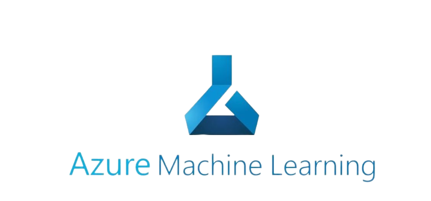

</center>

#### Por [Emiliano Rodríguez Pérez](https://github.com/Emiliano-RP) #IA Wizards
#### Sherpa: [José Jesús Guzmán Eusebio](https://github.com/josejesusguzman)
---
#### Requisitos:
- Tener un equipo de cómputo con Windows, Linux o MacOs.
- Tener conexión a internet.
- Tener un cuenta con suscripción de Microsoft Azure.
---
#### Instrucciones:
1.  Nos dirigimos al **[portal de Microsoft Azure](https://portal.azure.com/#home)** para iniciar sesión con el correo de **Innovacción Virtual**.
2. Una vez iniciada la sesión, en la página de inicio nos dirigimos a la **"Barra de búsqueda de recursos, servicios y documentos"** para buscar **"Azure Machine Learning"**. 
<center>

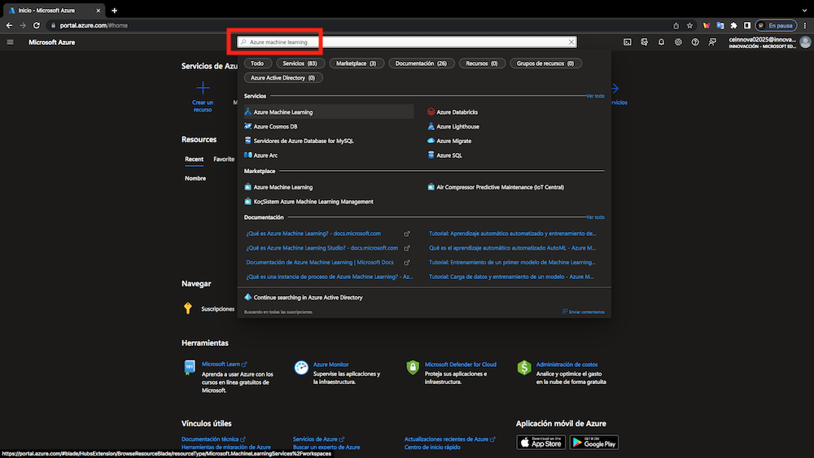

</center>

3.  Damos click en **"Crear"**.
<center>


</center>

4. Estando en el apartado **"Creación de un área de trabajo de Machine Learning"**, y en la pestaña de **"Aspectos básicos"**, colocamos la información pertinente para crear el recurso **(suscripción, grupo de recursos (*en caso de no tener grupo de recursos se debe crear uno*), región o ubicación y nombre del área de trabajo**.

*Nota:* Los demás datos no se modifican.
<center>

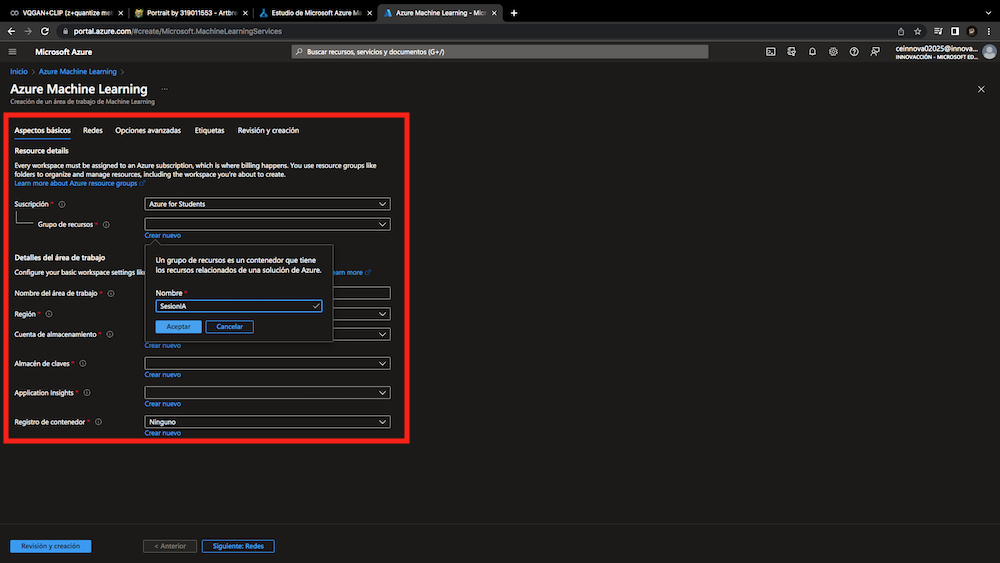

</center>

5. Damos click en **"Revisión y creación"**.
<center>

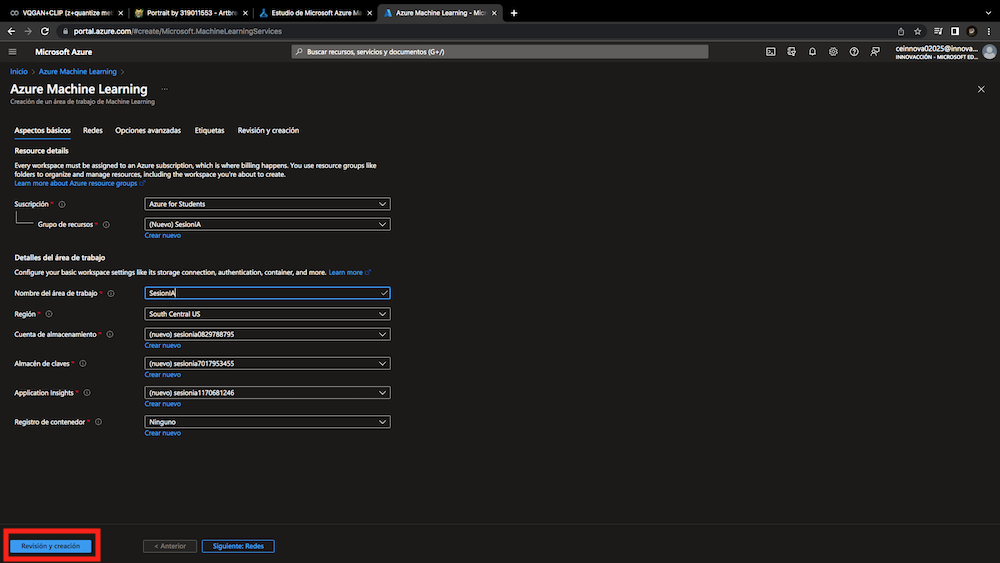

</center>

6. Si nos aparece el texto en verde **"Validación superada"**, podemos crear el recurso sin complicacion alguna.
<center>

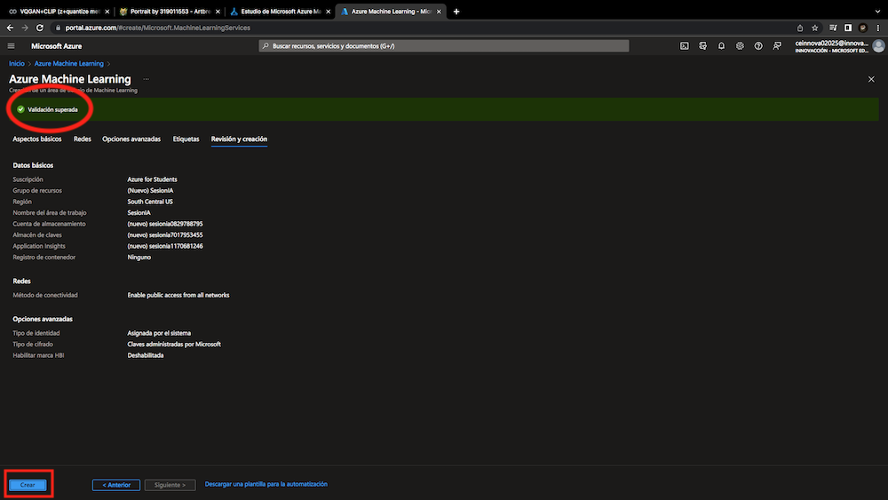

</center>

7. Esperamos a que la implementación termine correctamente.
<center>

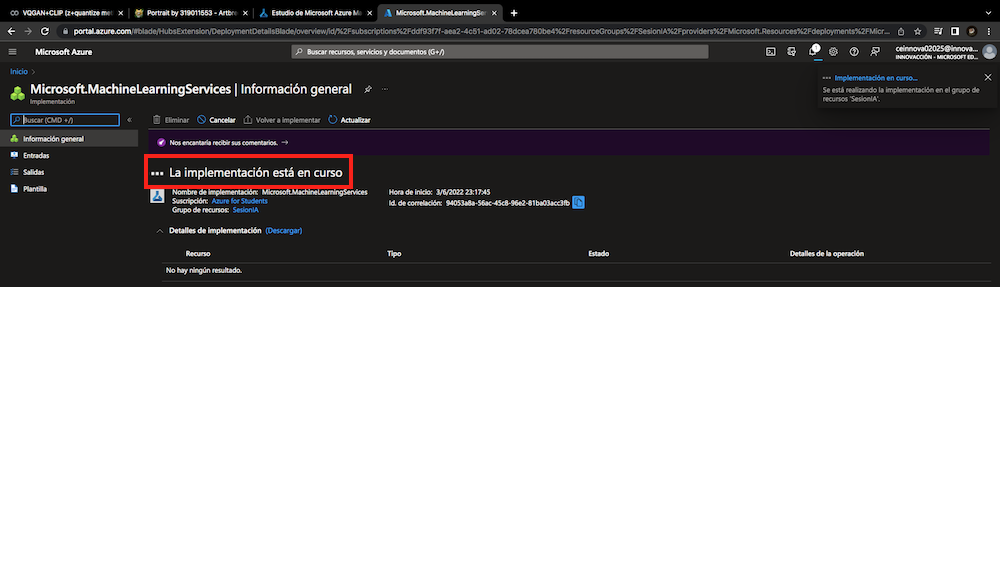

</center>

8. Ya implementado el recurso daremos click en **"Ir a recurso"**.
<center>

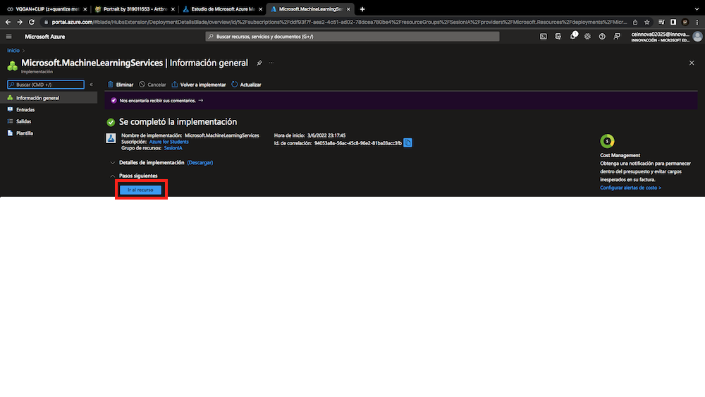

</center>

*Nota:* Cuando demos click en **"Ir a recurso"**, solamente checaremos que los datos como **grupo de recursos, ubicación y suscripción** estén correctos.
<center>

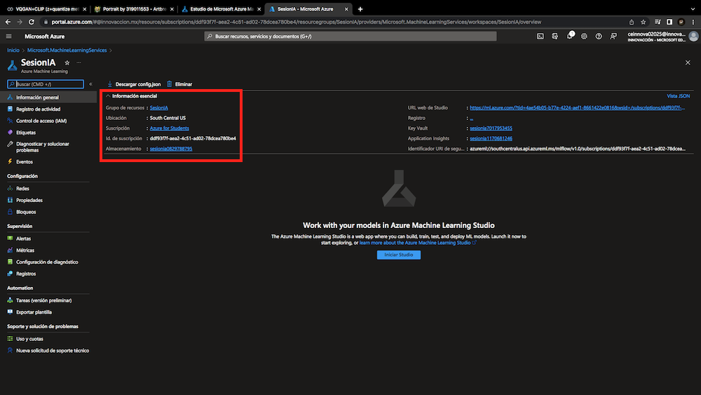

</center>

9. El recurso **no lo trabajaremos directamente en el portal de Azure** si no que abriremos una nueva pestaña en nuestro navegador y nos dirigiremos a la página del [estudio de Azure Machine Learning](https://ml.azure.com/home), que de igual manera se tendrá que **iniciar sesión con la cuenta de Innovacción Virtual**. Nos tiene que aparecer el área de trabajo que creamos en el portal de Azure, en este ejemplo si aparece como "SesionIA" y damos click en **"Ir a área de trabajo"**.
<center>

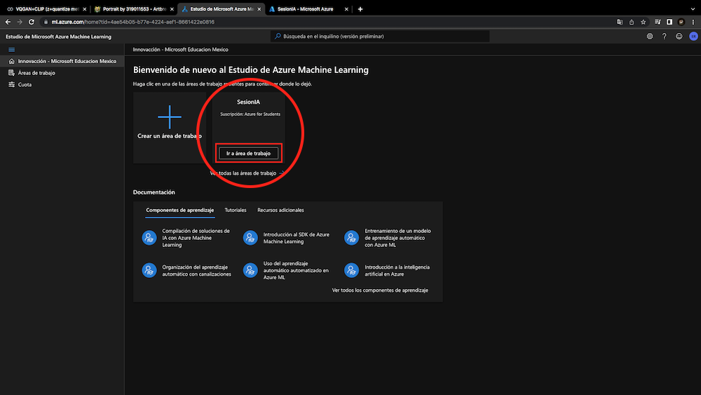

</center>

10. Dentro del área de trabajo podemos observar varias herramientas como:
* Autor:
    * Notebooks.
    * ML Automatizado.
    * Diseñador.
- Recursos:
    * Datos.
    * Trabajos.
    * Canalizaciones.
    * Entornos.
    * Modelos.
    * Puntos de conoxión.

Entre otras. Sin embargo en esta práctica utilizaremos **"Notebooks"** que son un entorno virtual el cual nos permite ejecutar código, principalmente de Python. Damos click en **"Proceso"**.
<center>

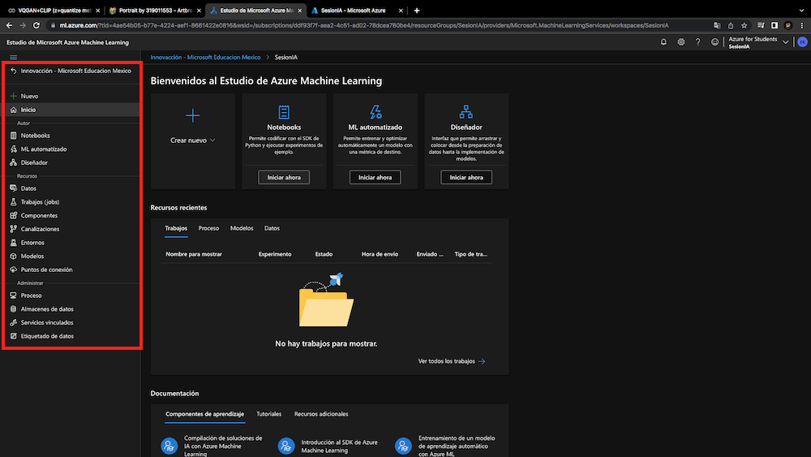

</center>

11. Estando en el apartado de **"Proceso"** y en la pestaña de **"Estancias de proceso"**, damos click en **"Nuevo"**, esto con la finalidad de crear un nuevo proceso.
<center>

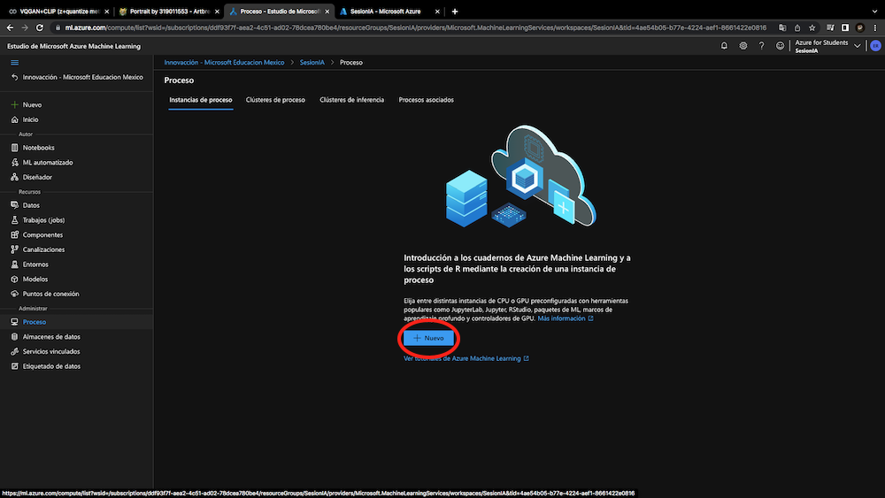

</center>

12. Para crear un nuevo proceso, debemos de **asignarle un nombre, tipo de máquina virtual, y el tamaño de la máquina virtual**.
<center>

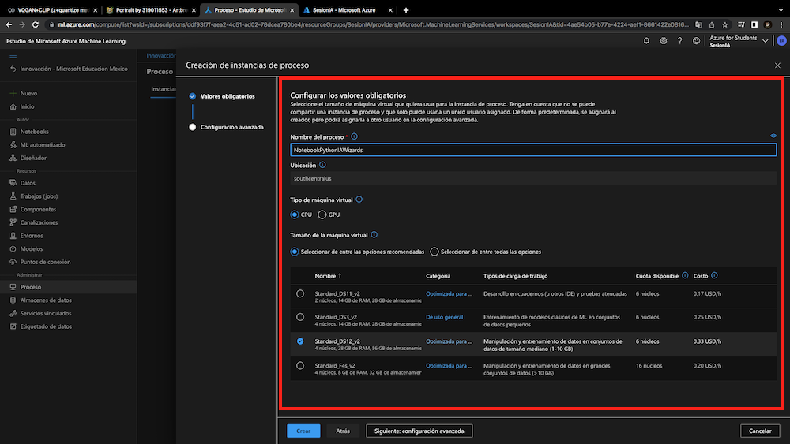

</center>

*Nota:* Es recomendable que el tamaño de la máquina virtual sea el de `Standar_DS11_v2` ya que es suficiente y no requerimos de más recursos de una máquina virtual.

Le damos click en **"Crear"**.

<center>

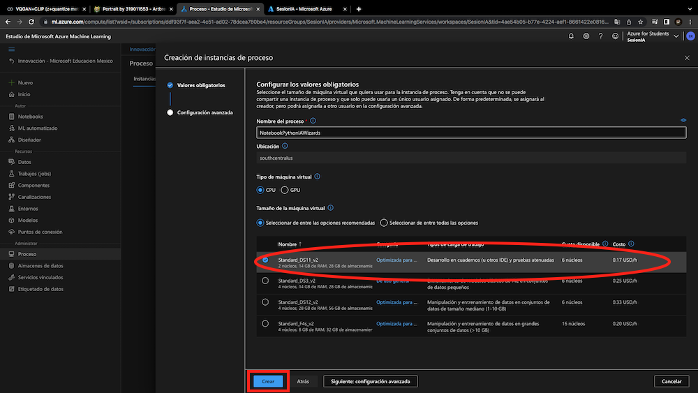

</center>

13. Esperamos a que el proceso se cree correctamente y que comience a ejecutarse.
<center>

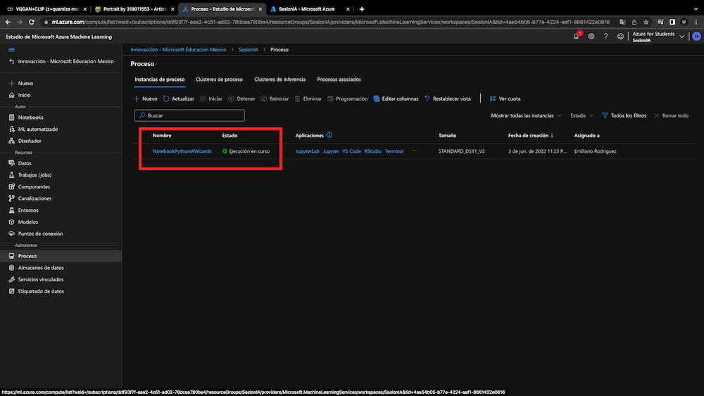

</center>

14. Ahora nos dirijimos al apartado de **"Notebooks"** y dentro de la carpeta con nuestro nombre de usuario, vamos a **crear un archivo**.
<center>

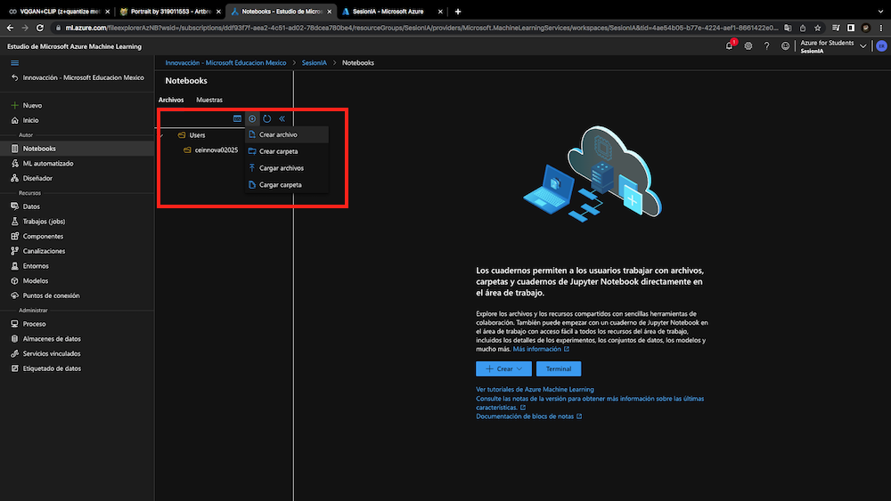

</center>

15. Al archivo le vamos a asignar el nombre **"Holamundo.ipynb"** o puede ser algún otro nombre pero es tradición asignar el "Holamundo" al primer archivo creado. Le damos click en **"Crear"**.
<center>

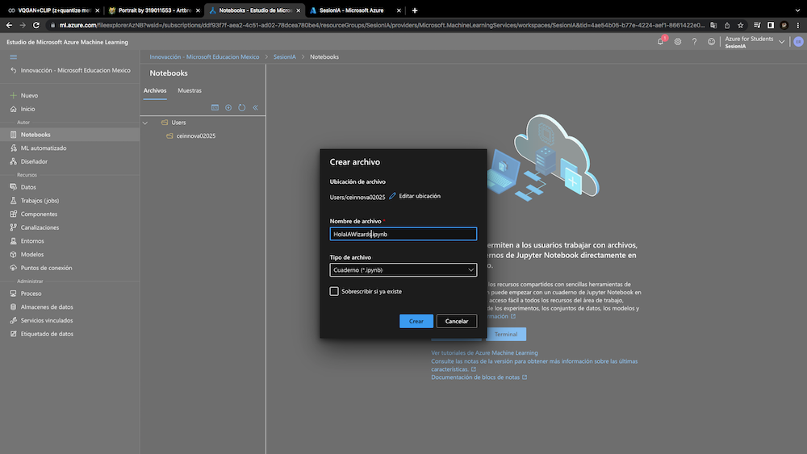

</center>

16. Una vez creado el archivo, procederemos a crear nuestro primer programa en **Python**. Por lo que ecribiremos el siguente código:

```python
print("Hola mundo")
```
Ejecutamos el código dando click en el botón de "reproducir" y nos aparecerá el siguiente mensaje:
<center>

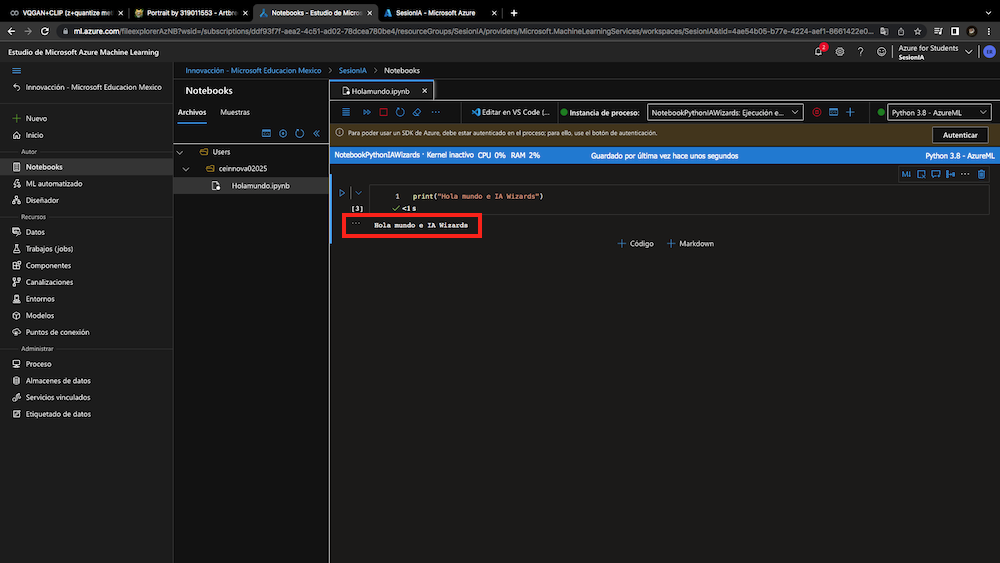

</center>

17. Finalmente es indispensable detener o en su caso eliminar el recurso, ya que se seguirá cobrando en caso de no hacerlo. Para ello, nos dirigimos nuevamente al apartado de **"proceso"**, seleccionamos el proceso que queramos detener o eliminar y damos click en los botones correspondientes.
<center>

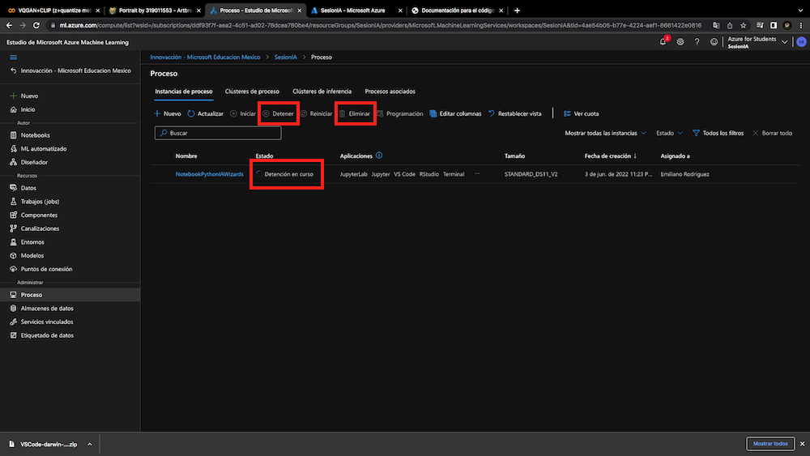

</center>

# Fin.
---
#### Por [Emiliano Rodríguez Pérez](https://github.com/Emiliano-RP) #IA Wizards
- ##### Instagram: [@_emiliano_rp](https://www.instagram.com/_emiliano_rp/)
- ##### Facebook: [Emiliano Rodríguez Pérez](https://www.facebook.com/emiliano.rodriguezperez.94/)

<center>


</center>

---


